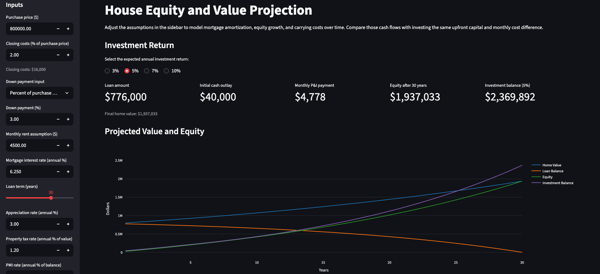
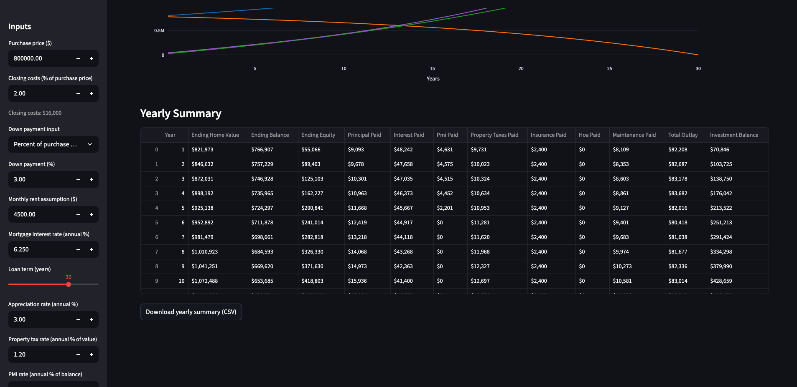

# Homebuying Finances  

This is a tool to help you project the finances of buying a home and compare returns from investing the same capital (minus renting costs) into stocks.

## Screenshots






## Usage

```bash
python -m venv house_finances
source house_finances/bin/activate
pip install -r requirements.txt
streamlit run streamlit_app.py
```

